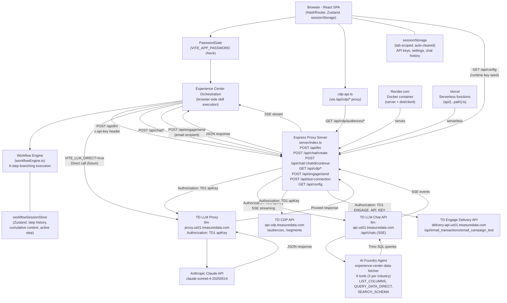
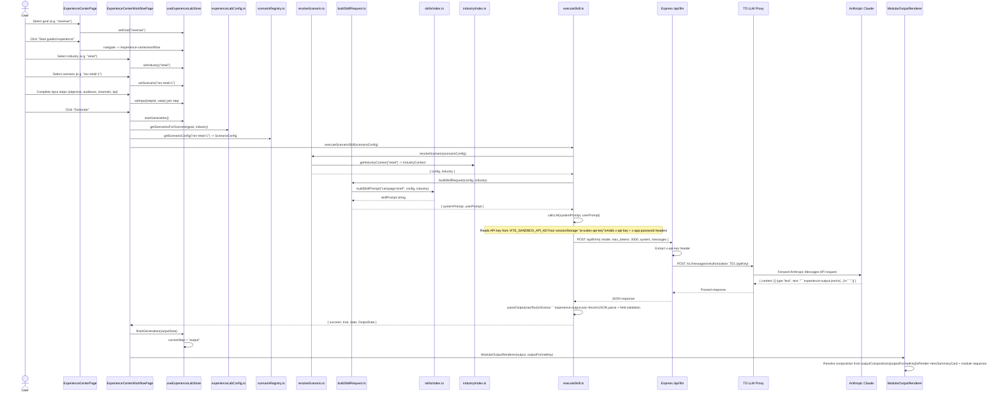
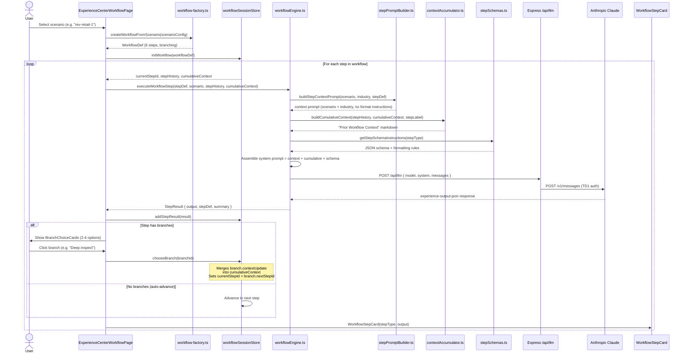
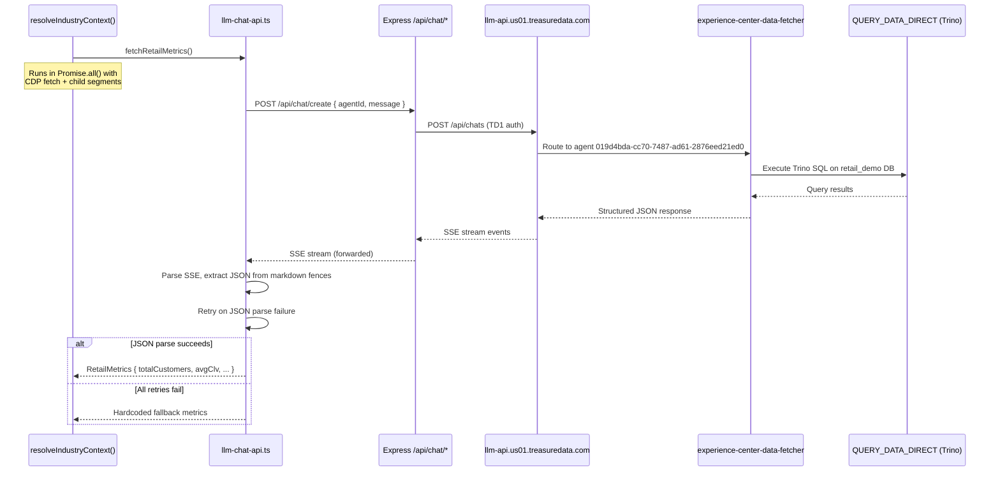
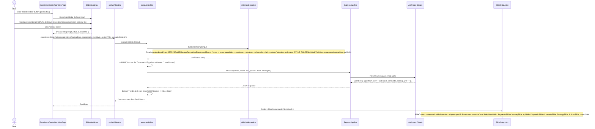
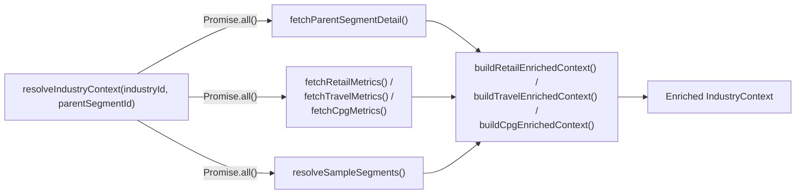

# Treasure AI Experience Center — Architecture Document

> Updated: 2026-04-08. Reflects PRs #1–#45 (all merged).

---

## Table of Contents

1. [Overview](#1-overview)
2. [High-Level Architecture Diagram](#2-high-level-architecture-diagram)
3. [Frontend Architecture](#3-frontend-architecture)
4. [Orchestration & LLM Data Flow](#4-orchestration--llm-data-flow)
   - 4a. [Multi-Step Workflow Engine](#4a-multi-step-workflow-engine)
   - 4b. [Chat API Integration (Live Metrics)](#4b-chat-api-integration-live-metrics)
5. [Slide Generation Flow](#5-slide-generation-flow)
6. [CDP Integration](#6-cdp-integration)
7. [Security & Privacy Architecture](#7-security--privacy-architecture)
8. [Deployment Architecture](#8-deployment-architecture)
9. [Configuration Reference](#9-configuration-reference)
10. [Evolution & Key Design Decisions](#10-evolution--key-design-decisions)

---

## 1. Overview

The **Treasure AI Experience Center** is a public-facing, zero-login web application that lets enterprise marketers experience Treasure AI capabilities through a guided, multi-step workflow. A visitor selects a business goal (e.g. "Increase revenue"), an industry vertical (Retail, CPG, Travel), and a specific use-case scenario from a library of 36 pre-defined scenarios. The app then executes a **6-step branching workflow** — each step assembles a context-aware LLM prompt enriched with live CDP data and Chat API metrics, sends it to Anthropic's Claude model via Treasure Data's LLM Proxy, and renders a step-specific artifact (analysis card, profile inspection, strategy creation, comparison matrix, activation plan, or optimization summary). At branch points, the user chooses a direction (e.g. "Deep inspect" vs. "Quick compare"), and cumulative context from prior steps carries forward to ground subsequent LLM calls. Users can also generate a branded slide deck from any output. The app is designed as a PLG (Product-Led Growth) demand-generation tool: no signup, no API key required by the visitor (a sandbox key is pre-embedded), just a URL.

**Two execution modes coexist:**
1. **One-shot mode** (original) — A single LLM call generates the full multi-module output (audience cards, channel strategy, KPI framework, next actions, insight panel). Still functional for scenarios that don't have a workflow definition.
2. **Multi-step workflow mode** (current default) — `workflow-factory.ts` generates a 6-step branching workflow from the scenario's outcome type (`revenue`, `campaign-performance`, `retention`, `insights`). Each step is executed independently by `workflowEngine.ts`, with `contextAccumulator.ts` threading prior results into the next prompt.

**Data enrichment:** When a parent segment ID is available, the app enriches industry context with live CDP data (segment metadata, attribute groups, behaviors) and live metrics fetched via a Chat API agent with `QUERY_DATA_DIRECT` tool access to the demo databases. All three industries (retail, travel, CPG) have per-industry enrichment builders and metric fetchers. Hardcoded sample data serves as a fallback when live data is unavailable. Strict data constraints in the LLM prompt ensure the model uses only exact numbers from the CDP — no fabricated or extrapolated metrics.

**Persona & user journey:** A marketing manager or CMO at an enterprise brand visits the URL (shared by a sales rep or from a campaign). They are optionally shown a password gate (casual filter only). On the landing page they choose a goal from an auto-scrolling carousel, click "Start guided experience," select their industry, pick a scenario, and the multi-step workflow begins — presenting analysis, branch choices, and progressively richer artifacts over 4–6 steps. They can switch between step artifacts via tabs, generate a slide deck, or book a sales walkthrough.

---

## 2. High-Level Architecture Diagram



> **Note:** The `VITE_LLM_DIRECT=true` path (direct browser-to-LLM-proxy calls) is prepared in the code but not yet active in production. CDP API calls now route through the Express proxy (`/api/cdp/*`) instead of direct browser calls, avoiding CORS issues.

> **Note:** The Engage Delivery API (`/api/engage/send`) uses the `email_campaign_test` endpoint with **inline HTML** (no template merge variables). The proxy uses the same browser `x-api-key` header (account 13232) as all other API calls. `ENGAGE_API_KEY` env var is an optional fallback. The browser builds the full HTML email body with per-step-type rendering from workflow data, including findings, metrics, profiles, actions, and impact statements. The email also triggers a parallel file download — PPTX (via `pptxgenjs`) or PDF (via `jsPDF`) — generated on-the-fly from the same workflow step history.

---

## 3. Frontend Architecture

```mermaid
graph TD
    main["src/main.tsx\ninitBackend then ReactDOM.createRoot()"]
    ErrBound["ErrorBoundary"]
    PassGate["PasswordGate\n(VITE_APP_PASSWORD)"]
    App["App.tsx\nHashRouter"]

    Layout["Layout.tsx\n(top nav + gradient-bg overlay\nnav hidden on workflow page)"]

    ECPage["ExperienceCenterPage.tsx\n/experience-center\n(goal carousel, start)"]
    WFPage["ExperienceCenterWorkflowPage.tsx\n/experience-center/workflow\n(split-pane: chat + artifacts)"]
    SettingsPage["SettingsPage.tsx\n/settings\n(AI config + TDX config)"]

    SplitPane["SplitPaneLayout (inline)\n(resizable, collapsible left/right panels)"]

    subgraph ChatPanel["Left Panel - Chat"]
        SkillProgress["SkillProgressBlock\n(inline generation progress)"]
        BranchCards["BranchChoiceCards\n(2-4 clickable branch options)"]
    end

    subgraph ArtifactPanel["Right Panel - Artifacts"]
        WFProgress["WorkflowProgressIndicator\n(step dots + connectors)"]
        WFTabs["WorkflowArtifactTabs\n(tab bar for completed steps)"]
        WFCards["WorkflowStepCard\n(6 card types: analyze, inspect,\ncreate, compare, activate, optimize)"]
    end

    OutputLoader["OutputLoader.tsx\n(skeleton loading state)"]
    ModularOutput["ModularOutputRenderer\n(output-formats/modules/index.tsx)"]
    SlideOutput["SlideOutput.tsx\n(branded slide renderer)"]
    SlideModal["SlideModal.tsx\n(deck config modal)"]
    ApiKeyModal["ApiKeySetupModal.tsx"]
    BookModal["BookWalkthroughModal.tsx"]

    Modules["Output Modules\nHeroSummaryCard, ExecutiveSummary\nKpiFramework, CampaignBrief\nJourneyMap, SegmentCards\nPerformanceDiagnosis, ChannelStrategy\nInsightSummary, NextActions\nInsightPanel, BusinessImpact"]
    Primitives["Primitives (output-formats/primitives)\nOutputSection, HeroSummaryCard\nKpiStatTile, SegmentCard\nJourneyStageNode, ChannelRoleCard\nDiagnosticFindingCard, PriorityActionRow\nMiniSparkline, ScoreBar, etc."]
    DesignSystem["Design System\nsrc/design-system/\nButton, TextField, Tabs, Tag\nToast, Tooltip, Combobox, etc."]

    ExLabStore["useExperienceLabStore\n(Zustand: goal, industry, scenario\ncurrentStep, output, isGenerating)"]
    WFSessionStore["useWorkflowSessionStore\n(Zustand: workflowDef, currentStepId\nstepHistory, cumulativeContext\nisExecutingStep, activeStepIndex)"]
    SettingsStore["useSettingsStore\n(Zustand: theme, parentSegments\nselectedParentSegmentId)"]
    AppStore["useAppStore\n(Zustand: campaignDraft, campaigns)"]
    TraceStore["useTraceStore\n(Zustand: orchestration trace runs)"]

    main --> ErrBound --> PassGate --> App
    App --> Layout
    Layout --> ECPage
    Layout --> WFPage
    Layout --> SettingsPage

    WFPage --> SplitPane
    SplitPane --> ChatPanel
    SplitPane --> ArtifactPanel

    ChatPanel --> SkillProgress
    ChatPanel --> BranchCards

    ArtifactPanel --> WFProgress
    ArtifactPanel --> WFTabs
    ArtifactPanel --> WFCards

    WFPage --> OutputLoader
    WFPage --> ModularOutput
    WFPage --> SlideOutput
    WFPage --> SlideModal
    ECPage --> ApiKeyModal
    ECPage --> BookModal

    ModularOutput --> Modules
    Modules --> Primitives
    Primitives --> DesignSystem

    WFPage -.-> ExLabStore
    WFPage -.-> WFSessionStore
    ECPage -.-> ExLabStore
    SettingsPage -.-> SettingsStore
    Layout -.-> SettingsStore
    BranchCards -.->|chooseBranch()| WFSessionStore
    WFTabs -.->|reads stepHistory| WFSessionStore
    WFProgress -.->|reads stepHistory,\nisExecutingStep| WFSessionStore
```

**Key notes:**

- `HashRouter` is used so the app works when served from a static file server without server-side routing support.
- `initBackend()` runs before React renders and sets `window.aiSuites = webBackend`. This is a compatibility shim so code written for an Electron IPC backend works unchanged in the web context.
- `PasswordGate` wraps the entire app tree and blocks rendering until the correct `VITE_APP_PASSWORD` is entered (or if no password is configured, passes through immediately).
- `Layout.tsx` renders a full-bleed `gradient-bg.png` background overlay on experience center pages. The top navigation bar is **hidden on the workflow page** — navigation is embedded within the workflow card area instead.
- `ExperienceCenterWorkflowPage.tsx` is the largest file (~2200 lines) and orchestrates both one-shot and multi-step workflow modes. It contains the resizable `SplitPaneLayout` (left: chat panel, right: artifact panel) defined inline.
- **Workflow components** (new in the multi-step revamp):
  - `WorkflowProgressIndicator` — step dots with check marks (completed), pulse animation (executing), and step numbers (upcoming)
  - `WorkflowArtifactTabs` — horizontal tab bar to switch between completed step artifacts
  - `WorkflowStepCard` — 6 card types (analyze, inspect, create, compare, activate, optimize) with per-type layouts and `CardShell` wrapper
  - `BranchChoiceCards` — 2–4 clickable cards with icons, descriptions, and "Recommended" badges for branch decision points
  - `SkillProgressBlock` — real-time generation progress with stage badges and elapsed timer
- `useWorkflowSessionStore` is the Zustand store that manages multi-step workflow state: workflow definition, current step, step history, cumulative context, execution flags, and active artifact tab index.
- `useTraceStore` is present in the codebase but appears to be unused in the current Experience Center flow. It was likely carried over from an earlier multi-agent orchestration design.

---

## 4. Orchestration & LLM Data Flow

The orchestration layer supports two modes: **one-shot** (original, single LLM call) and **multi-step workflow** (current default, 6-step branching execution). This section covers the one-shot flow; see §4a for the workflow engine and §4b for the Chat API integration.

### One-Shot Flow (Legacy)



**Orchestration layer file map:**

| File | Role |
|------|------|
| `src/experience-center/registry/scenarioRegistry.ts` | Source of truth for all 36 scenarios (scenarioId → ScenarioConfig) |
| `src/experience-center/registry/skillFamilies.ts` | Defines 5 skill families and their default output module lists |
| `src/experience-center/orchestration/resolveScenario.ts` | Pairs ScenarioConfig with its IndustryContext |
| `src/experience-center/orchestration/buildSkillRequest.ts` | Assembles systemPrompt + userPrompt including output schema |
| `src/experience-center/orchestration/skills/index.ts` | Dispatches to per-skill-family prompt builders |
| `src/experience-center/orchestration/skills/campaign-brief.ts` | Prompt builder for campaign-brief skill family |
| `src/experience-center/orchestration/skills/journey.ts` | Prompt builder for journey skill family |
| `src/experience-center/orchestration/skills/segment-opportunity.ts` | Prompt builder for segment-opportunity skill family |
| `src/experience-center/orchestration/skills/performance-analysis.ts` | Prompt builder for performance-analysis skill family |
| `src/experience-center/orchestration/skills/insight-summary.ts` | Prompt builder for insight-summary skill family |
| `src/experience-center/orchestration/industry/retail.ts` | Hardcoded retail sample data (segments, metrics, channels, terminology) |
| `src/experience-center/orchestration/industry/cpg.ts` | Hardcoded CPG sample data |
| `src/experience-center/orchestration/industry/travel.ts` | Hardcoded travel sample data |
| `src/experience-center/orchestration/industry/index.ts` | `resolveIndustryContext()` — orchestrates live CDP + Chat API + fallback enrichment |
| `src/experience-center/orchestration/executeSkill.ts` | Entry point: resolves → builds → calls LLM → parses → returns |

**Output schema:** The LLM is instructed to return a JSON object wrapped in a ` ```experience-output-json ` code fence. The schema enforces: `summaryBanner`, `executiveSummary`, `audienceCards` (exactly 3), `channelStrategy`, `scenarioCore`, `kpiFramework` (exactly 4, with `trend` sparkline array), `nextActions` (exactly 5), and `insightPanel`. `parseOutput()` in `executeSkill.ts` extracts the fence, `JSON.parse`s it, and normalises any non-array fields the LLM may have returned incorrectly.

> **Note:** `src/services/experienceLabOutputs.ts` contains a fully hardcoded fallback output generator that does not call the LLM at all. It is used as a reference / emergency fallback but is not wired into the current primary flow, which always calls the LLM.

---

### 4a. Multi-Step Workflow Engine

The multi-step workflow engine replaces the single LLM call with a 6-step branching execution model. Each step is an independent LLM call grounded in cumulative context from prior steps and user branch choices.



**Workflow engine file map:**

| File | Role |
|------|------|
| `src/experience-center/registry/workflows/workflow-factory.ts` | Maps scenario outcome (`revenue`, `campaign-performance`, `retention`, `insights`) to a 6-step branching workflow template. Each template defines step labels, prompts, skill families, output modules, and branch definitions with icons, descriptions, and context updates |
| `src/experience-center/orchestration/workflowEngine.ts` | Executes a single workflow step: resolves industry context, builds prompt (context + cumulative + schema), calls LLM via `/api/llm`, parses `experience-output-json` response. Supports both LLM-powered and simulated (mock data) execution modes. 90-second timeout |
| `src/experience-center/orchestration/stepSchemas.ts` | Defines per-step-type JSON output schemas for 6 step types: `analyze` (3 findings, 3 metrics), `inspect` (3 profiles, sections), `create` (4–6 sections, channels), `compare` (3 options with recommendation), `activate` (destinations, sections), `optimize` (metrics, changes). Enforces `experience-output-json` code fence format |
| `src/experience-center/orchestration/stepPromptBuilder.ts` | Builds the context portion of the prompt: scenario metadata (title, intent, audience, KPI) + industry context (segments, metrics, channels). Detects live vs. sample data and adds data-driven requirement section. Does NOT include output format instructions (separation of concerns with `stepSchemas.ts`) |
| `src/experience-center/orchestration/contextAccumulator.ts` | Serializes step history into LLM-consumable context: each completed step's label, type, summary, and chosen branch. Appends accumulated context key-value pairs (e.g. `action: 'inspect'`). Returns markdown "Prior Workflow Context" section |
| `src/stores/workflowSessionStore.ts` | Zustand store: `workflowDef`, `currentStepId`, `stepHistory[]`, `cumulativeContext{}`, `isExecutingStep`, `activeStepIndex`. Actions: `initWorkflow()`, `addStepResult()`, `chooseBranch()`, `resetWorkflow()`, `setActiveStepIndex()` |

**Workflow templates (4 outcome types):**

| Outcome | Template Pattern | Branch Points |
|---------|-----------------|---------------|
| `revenue` | analyze → inspect/compare/create → create → enhance → summary | After step 1: "Deep inspect", "Quick compare", "Jump to creation" |
| `campaign-performance` | analyze → inspect/compare/create → create → enhance → summary | After step 1: "Inspect profiles", "Compare segments", "Create strategy" |
| `retention` | analyze → inspect/compare/create → create → enhance → summary | After step 1: "Inspect churn", "Compare cohorts", "Create journey" |
| `insights` | analyze → inspect/compare/create → create → enhance → summary | After step 1: "Deep inspect", "Compare trends", "Create report" |

---

### 4b. Chat API Integration (Live Metrics)

The Chat API fetches live metrics from Treasure Data's AI Foundry platform by creating chat sessions that invoke a pre-configured agent with access to per-industry knowledge bases.



**Chat API file map:**

| File | Role |
|------|------|
| `src/services/llm-chat-api.ts` | Creates chat sessions, parses SSE streams, extracts JSON metrics. Exports `fetchRetailMetrics()`, `fetchTravelMetrics()`, `fetchCpgMetrics()` with typed return interfaces (`RetailMetrics`, `TravelMetrics`, `CpgMetrics`) |
| `server/index.ts` (`/api/chat/*`) | Two proxy routes: `POST /api/chat/create` → `llm-api.us01.treasuredata.com/api/chats` and `POST /api/chat/:chatId/continue` → SSE streaming relay |

**Agent configuration:**
- Agent ID: `019d4bda-cc70-7487-ad61-2876eed21ed0`
- Agent name: `experience-center-data-fetcher`
- Model: `claude-4.5-sonnet`
- 9 tools (3 per industry — LIST_COLUMNS, QUERY_DATA_DIRECT, SEARCH_SCHEMA):
  - Retail: `list_retail_columns`, `query_retail_data`, `search_retail_schema` → `retail-demo-kb`
  - Travel: `list_travel_columns`, `query_travel_data`, `search_travel_schema` → `travel-demo-kb`
  - CPG: `list_cpg_columns`, `query_cpg_data`, `search_cpg_schema` → `cpg-demo-kb`
- 3 knowledge bases: `retail-demo-kb`, `travel-demo-kb`, `cpg-demo-kb`

**Current status:** The agent executes real Trino SQL queries against all three demo databases. The system prompt includes database schemas, expected JSON response formats, example query strategies, and strict rules (never guess, always use real SQL). Verified: all 3 industries return real queried data (retail: 0.866 repeat rate, travel + CPG: real metrics from DB).

**Known issue:** Travel and CPG `email_open_rate` can exceed 1.0 because the agent computes total opens / total sent (multiple opens per email), not unique openers / unique recipients.

**Engage Delivery API & Share/Export file map:**

| File | Role |
|------|------|
| `src/services/engage-api.ts` | Browser client — `sendEmail(toAddress, output, wfStepHistory)` builds full inline HTML email with per-step-type renderers (analyze, inspect, create, compare, activate, optimize) and sends via `/api/engage/send`. Uses `email_campaign_test` endpoint (no template needed). |
| `src/services/export-slides.ts` | PPTX generator — `generatePptxFromWorkflow(steps)` creates branded PowerPoint from workflow step history using `pptxgenjs`. Typed renderers for all 6 step types. `generatePptxFromOutput(output)` for one-shot mode. `generatePptx(deck)` for pre-generated DeckData. |
| `src/services/export-pdf.ts` | PDF generator — `generatePdf(output, wfStepHistory)` creates branded A4 PDF using `jsPDF`. Per-step-type renderers with metrics boxes, finding cards, profile cards, action lists. |
| `server/index.ts` (`/api/engage/send`) | Proxy route — forwards to `delivery-api.us01.treasuredata.com/api/email_transactions/email_campaign_test` with browser `x-api-key` auth (account 13232) |

**Engage configuration:**
- Sender: `noreply@plg.treasure-engage-testing.link` (ID: `019d6e37-5083-7c4e-af1b-9697114b4e16`, account 13232)
- Auth: browser `x-api-key` header (same 13232 key as all other APIs), `ENGAGE_API_KEY` env var as fallback
- Workspace: `019d69ca-5d11-78f9-a0ee-23ee343827a0`
- No template needed — inline HTML sent via `email_campaign_test` endpoint

**Share/Export flow:**
1. User clicks Share → chooses Slide Deck or PDF Report → enters email
2. File generates in browser from workflow step history (PPTX or PDF) → auto-downloads
3. Email sends in parallel with full analysis as inline HTML
4. All outputs use official Treasure AI 2026 palette: `#2D40AA`, `#847BF2`, `#C466D4`, `#80B3FA`, `#F3CCF2`, `#FFE2BD`, `#FDB893`, `#F9FEFF`

---

## 5. Slide Generation Flow



**Storyboard resolution:** `buildSlidePrompt()` in `src/experience-center/orchestration/skills/slide-deck.ts` maintains a `STORYBOARDS` map keyed by `outputFormatKey` (e.g. `campaign_brief`, `journey_map`, `segment_cards`) and `deckLength` (3, 5, or 7). This tells Claude the exact slide sequence to generate. Example for `campaign_brief` at 7 slides: `cover → recommendation → audience → strategy → channels → kpi → actions`.

**Slide layouts:** 10 named layouts — `cover`, `hero`, `segments`, `journey`, `kpi`, `diagnosis`, `channels`, `strategy`, `actions`, `impact`. Each has a typed data contract defined in `src/experience-center/output-formats/slides/types.ts` and a corresponding React component in `SlideOutput.tsx`. The `SlideContent` function routes `slide.layout` to the correct component.

**Loading state:** `OutputLoader.tsx` with `variant="slides"` renders a `SlideSkeleton` component with a cycling status message ("Preparing slide outline", "Mapping content to slides", etc.) while the LLM call is in flight.

---

## 6. CDP Integration

### API key and endpoint

The TDX API key is read from two possible sources (in priority order):
1. `sessionStorage` key `ai-suites-tdx-api-key` (set by the user in Settings or seeded from `/api/config` at startup)
2. `import.meta.env.VITE_SANDBOX_API_KEY` (build-time baked key for sandbox deployments)

The CDP endpoint is derived from the user's selected region stored in `sessionStorage` under `ai-suites:settings` → `tdxEndpoint`. The `getCdpEndpoint()` function in `cdp-api.ts` rewrites `api.treasuredata.com` → `api-cdp.treasuredata.com` automatically. Default: `https://api-cdp.treasuredata.com`.

### Proxied browser calls

CDP API calls route through the Express proxy (`GET /api/cdp/*`) which forwards to `api-cdp.treasuredata.com` with `Authorization: TD1 {apiKey}` headers. This avoids CORS issues.

```
Browser → GET /api/cdp/audiences
          x-api-key: {tdxApiKey}
Express → GET api-cdp.treasuredata.com/audiences
          Authorization: TD1 {tdxApiKey}

Browser → GET /api/cdp/audiences/{parentId}/segments
Express → GET api-cdp.treasuredata.com/audiences/{parentId}/segments
```

### What data is fetched

| Endpoint | Data returned | Used for |
|----------|---------------|----------|
| `GET /audiences` | List of parent segments (id, name, population, description, masterTable) | `useSettingsStore.fetchParentSegments()` — populates parent segment selector in UI |
| `GET /audiences/{id}/segments` | Nested child segments, flattened with folderPath | `resolveSampleSegments()` — injects real segment names into LLM prompts when 2+ meaningful names exist |
| `GET /audiences/{id}` | Full parent segment detail (attributeGroups, behaviors, population) | `fetchParentSegmentDetail()` — provides CDP schema for per-industry enrichment builders |

### Live CDP data enrichment

**Current state (as of 2026-04-06):** All three industries (retail, travel, CPG) are enriched with live CDP data when a parent segment ID is available. The enrichment flow runs in `resolveIndustryContext()` which orchestrates three parallel fetches:



**Per-industry enrichment builders:**

| Builder | Data sources | What it produces |
|---------|-------------|-----------------|
| `buildRetailEnrichedContext()` | CDP attributes + behaviors, retail metrics, child segments | `sampleSegments`, `sampleMetrics`, `channelPreferences`, `sampleDataContext` narrative |
| `buildTravelEnrichedContext()` | CDP attributes + behaviors, travel metrics, child segments | Same shape, travel-specific terminology |
| `buildCpgEnrichedContext()` | CDP attributes + behaviors, CPG metrics, child segments | Same shape, CPG-specific terminology |

**Key helper functions:**

| Function | Purpose |
|----------|---------|
| `deriveChannelPreferences(detail, baseContext)` | Extracts channel preferences from consent-related attributes in CDP metadata. Generalized with `baseContext` param to work across all industries |
| `resolveSampleSegments(parentSegmentId)` | Fetches live child segments and uses them only if 2+ have real names (filters out "test", "untitled"). Falls back to hardcoded sample segments otherwise |

**Dual-source data model:** The enriched `IndustryContext` object passed to LLM prompts combines:
1. **CDP API** — segment schema, attribute groups, behavior definitions, population counts
2. **Chat API** — live metrics (totalCustomers, avgClv, conversionRate, etc.) fetched via AI Foundry agent
3. **Hardcoded fallback** — industry-specific sample data from `retail.ts`, `cpg.ts`, `travel.ts` used when either live source fails

The `sampleDataContext` field is a narrative string injected into the LLM prompt that describes the data source ("Live CDP Data" vs "Sample Data") and the key metrics available. `stepPromptBuilder.ts` detects live vs. sample data and adds a data-driven requirement section for live data.

> **Note:** The `docs/legal-security-privacy-review.md` document explicitly calls out the transition to live TDX data in LLM prompts. This has privacy and data processing agreement implications (see Section 7).

---

## 7. Security & Privacy Architecture

### sessionStorage-only data (privacy by architecture)

All user data (API keys, settings, chat history, session state) is stored exclusively in `sessionStorage` via the `src/utils/storage.ts` wrapper. `sessionStorage` is:
- **Tab-scoped**: data is not shared across tabs or browser windows
- **Auto-cleared**: all data is destroyed when the tab is closed
- **Never persisted to a server**: the Express proxy is stateless and writes nothing to disk

This means there is no cross-user data leakage risk on the server side. PR #2 ("Refactor to browser-only architecture") explicitly cites "privacy by architecture" as the motivation for this design.

**sessionStorage keys in use:**

| Key | Content |
|-----|---------|
| `ai-suites-api-key` | LLM proxy API key |
| `ai-suites-tdx-api-key` | TDX CDP API key |
| `ai-suites:settings` | Model, LLM proxy URL, TDX endpoint, TDX database |
| `ai-suites:chat-history` | Chat conversation history (multi-turn) |
| `ai-suites:saved-chats` | Named saved chats |
| `ai-suites:blueprints` | Saved blueprint objects |
| `app_authenticated_v2` | Whether the password gate has been passed |

### App password guard

`VITE_APP_PASSWORD` is embedded in the JavaScript bundle at build time. `PasswordGate.tsx` checks the entered password against this constant. The code and the legal review document both explicitly state: **this is a casual visitor filter only, not real security**. Anyone who inspects the bundle source can extract the password. This is acceptable because the sandbox API key has its own rate limiting and the app is designed as a public-facing demo.

The server also has a separate `APP_PASSWORD` environment variable checked via an Express middleware on all `/api/*` routes. Client code sends this as the `x-app-password` request header. The two passwords are set to the same value in `render.yaml` (`TDsuperhuman`).

### API key handling

The flow for LLM API key usage:

1. **Build time (Vercel/static):** `VITE_SANDBOX_API_KEY` is baked into the JS bundle. All users share this key. No key entry required.
2. **Runtime (Docker/Render):** `GET /api/config` endpoint (registered before the password gate middleware) returns `{ sandboxApiKey }` from the server's `process.env.API_KEY`. `initBackend()` in `backend.ts` seeds this into `sessionStorage` before React renders. This solves the problem where `VITE_` env vars cannot be set at Render dashboard runtime (they require a rebuild).
3. **Manual entry:** Users can enter their own key in Settings. It is saved to `sessionStorage` and sent as `x-api-key` on every `/api/llm` request.

The Express proxy receives the key as the `x-api-key` request header and adds the `Authorization: TD1 {apiKey}` header required by the TD LLM Proxy. **The raw API key is never logged by the proxy server.**

### CORS and `VITE_LLM_DIRECT` flag

The `VITE_LLM_DIRECT=true` build-time flag in `executeSkill.ts` switches LLM calls from routing through `/api/llm` to calling `TD LLM Proxy` directly from the browser. In direct mode, the browser sends `Authorization: TD1 {apiKey}` directly. This flag was added in PR #8 to prepare for a future state where the TD LLM Proxy adds CORS support, enabling full static deployment (no Express server needed). As of now, the flag is not set in production; all LLM calls go through the proxy.

The Express server sets `cors()` (allow all origins, `*`) with no restrictions. This is noted as an open question in the legal/security review.

### Live CDP data in LLM prompts

When a parent segment ID is configured, LLM prompts now include **live CDP metadata**: segment names, attribute group names, behavior names, and population counts. The system prompt includes: "All outputs use sample data and should be framed as illustrative recommendations that showcase Treasure AI capabilities." However, the actual data injected may be live CDP metadata (not PII, but real segment schema). No raw customer records or individual-level PII are sent — only aggregate metadata (attribute names, segment names, population counts, aggregate metrics).

When live data is unavailable (no parent segment configured, or API failures), the system falls back to hardcoded sample data from `retail.ts`, `cpg.ts`, `travel.ts`.

### Deployment secrets

Render environment variables (set in the Render dashboard, not committed to git):
- `VITE_SANDBOX_API_KEY` (marked `sync: false` in `render.yaml` — not synced from file, must be set manually in Render dashboard)
- `APP_PASSWORD` / `VITE_APP_PASSWORD` (set to `TDsuperhuman` in `render.yaml`)
- `NODE_ENV=production`

> **Note:** The `.env` file in the repository root contains a real API key (`13232/be115c8ce956db64a6116b9c760002cf93684765`). This file is not in `.dockerignore` but should not be committed to git in production scenarios. For a public repo this would be a credential leak. The `.env.example` is the safe version to share.

### What data leaves the browser and where it goes

| Data | Destination | Notes |
|------|-------------|-------|
| LLM prompt (system + user messages, includes industry context — live CDP metadata when available, else hardcoded sample data) | Browser → Express proxy → TD LLM Proxy → Anthropic Claude | May include real segment names, attribute names, population counts. No individual-level PII. Anthropic DPA applicability is an open question per legal review |
| Chat API messages (metric fetch requests) | Browser → Express proxy → TD LLM Chat API → AI Foundry Agent | Agent executes Trino SQL on demo databases. Results contain aggregate metrics only |
| API key (`x-api-key` header) | Browser → Express proxy only | Proxy converts to `TD1` auth and forwards; key never logged |
| TDX API key | Browser → Express proxy → api-cdp.treasuredata.com | Routed through `/api/cdp/*` proxy. Key sent as `Authorization: TD1` header |
| CDP segment data (names, attribute groups, population counts) | api-cdp.treasuredata.com → Express proxy → Browser → LLM prompt | Now forwarded to LLM as part of enriched industry context |
| Chat messages | Browser → Express proxy → TD LLM Proxy | Multi-turn; history in sessionStorage only |
| Booking form data (name, email, company, role) | Not sent anywhere yet | Backend integration planned; currently a UI placeholder |

---

## 8. Deployment Architecture

```mermaid
graph TD
    subgraph LocalDev["Local Development"]
        ViteServer["Vite Dev Server\nport 5175\nvite.web.config.ts\n(proxies /api -> :3001)"]
        TSXWatch["tsx watch server/index.ts\nport 3001\nRoutes: /api/llm, /api/chat/*,\n/api/cdp/*, /api/engage/send,\n/api/config, /api/test-connection"]
        Concurrently["npm run dev\n(concurrently)"]
        Concurrently --> ViteServer
        Concurrently --> TSXWatch
    end

    subgraph RenderDeploy["Render Deployment (Primary)"]
        DockerBuild["Docker Build\nnode:22 base\nnpm install\nnpm run build:client\n(VITE_APP_PASSWORD + VITE_SANDBOX_API_KEY\nbaked in as build args)"]
        DockerRun["Docker Run\nnpx tsx server/index.ts\nport 3001\nserves dist/client as static\nRoutes: /api/llm, /api/chat/*,\n/api/cdp/*, /api/engage/send,\n/api/config"]
        RenderEnv["Render Env Vars\nAPP_PASSWORD, VITE_APP_PASSWORD\nVITE_SANDBOX_API_KEY (sync:false)\nNODE_ENV=production"]
        DockerBuild --> DockerRun
        RenderEnv --> DockerBuild
        RenderEnv --> DockerRun
    end

    subgraph VercelDeploy["Vercel Deployment (Alternative)"]
        VercelBuild["npm run build:vercel\nVite build -> dist/client"]
        VercelFunc["api/[...path].ts\nServerless function\nimports Express app\nmaxDuration: 60s"]
        VercelRoutes["vercel.json routes\n/api/* -> serverless fn\n/* -> index.html"]
        VercelBuild --> VercelFunc
        VercelFunc --> VercelRoutes
    end

    subgraph StaticFuture["Future: Static CDN (post-CORS)"]
        StaticFiles["dist/client static files\n(no server needed)"]
        LLMDirect["VITE_LLM_DIRECT=true\nBrowser -> TD LLM Proxy directly"]
        StaticFiles --> LLMDirect
    end
```



**Build scripts (`package.json`):**

| Script | What it does |
|--------|-------------|
| `npm run dev` | `concurrently` starts `tsx watch server/index.ts` (port 3001) and `vite --config vite.web.config.ts` (port 5175) |
| `npm run build:client` | `vite build --config vite.web.config.ts` → `dist/client/` |
| `npm run build:server` | `tsc -p tsconfig.server.json` → `dist/server/` (used for `npm start`) |
| `npm run build:vercel` | Same as `build:client` (alias used in `vercel.json`) |
| `npm start` | `node dist/server/index.js` (requires pre-built server) |

**Docker specifics (`Dockerfile`):**
- Base image: `node:22`
- Installs `git` and `ripgrep` (carried over from an earlier Claude Code subprocess use)
- Build args `VITE_APP_PASSWORD` and `VITE_SANDBOX_API_KEY` are passed at build time and baked into the client bundle via Vite
- Runtime: `npx tsx server/index.ts` (runs TypeScript server directly, avoiding a separate compile step)
- Exposes port 3001; `NODE_OPTIONS="--max-old-space-size=512"` caps memory usage

**Vercel specifics (`vercel.json`):**
- `api/[...path].ts` is a catch-all serverless function that imports the Express `app` from `server/index.ts` and exports it as the default handler
- The Express server detects `process.env.VERCEL` and skips `app.listen()` (serving static files is handled by Vercel's CDN)
- Max function duration: 60 seconds (for LLM call timeout headroom)

---

## 9. Configuration Reference

| Variable | Purpose | Used by | Build-time or Runtime | Required |
|----------|---------|---------|----------------------|----------|
| `API_KEY` | LLM proxy API key served from `/api/config` endpoint at runtime | Server (`server/index.ts`) | Runtime | For Docker/Render deploys without build-time key baking |
| `LLM_PROXY_URL` | Override the default TD LLM Proxy URL | Server (`server/index.ts`) | Runtime | No (default: `https://llm-proxy.us01.treasuredata.com`) |
| `MODEL` | Override Claude model (unused in current server code, noted in `.env.example`) | Not currently referenced in server | Runtime | No |
| `APP_PASSWORD` | Server-side password gate for all `/api/*` routes | Server (`server/index.ts`) | Runtime | No (gate disabled if unset) |
| `PORT` | HTTP port for the Express server | Server (`server/index.ts`) | Runtime | No (default: `3001`) |
| `VITE_SANDBOX_API_KEY` | Sandbox API key baked into the client bundle; used for both LLM and TDX calls when no user-entered key exists | Client (`executeSkill.ts`, `web-backend.ts`, `cdp-api.ts`, `api/client.ts`, `chat-client.ts`) | Build-time (also available at runtime via `/api/config`) | No (users prompted to enter key if absent) |
| `VITE_APP_PASSWORD` | Password baked into client bundle for `PasswordGate.tsx` | Client (`PasswordGate.tsx`, `executeSkill.ts`, `web-backend.ts`, `chat-client.ts`) | Build-time | No (gate disabled if unset) |
| `VITE_LLM_DIRECT` | When `"true"`, bypasses Express proxy and calls TD LLM Proxy directly from browser | Client (`executeSkill.ts`) | Build-time | No (default: routes through proxy) |
| `VITE_LLM_PROXY_URL` | Override the TD LLM Proxy URL for direct browser calls (`VITE_LLM_DIRECT=true` mode) | Client (`executeSkill.ts`) | Build-time | No (default: `https://llm-proxy.us01.treasuredata.com`) |
| `VITE_API_BASE` | Override the API base path for server calls | Client (`executeSkill.ts`, `web-backend.ts`, `api/client.ts`, `chat-client.ts`) | Build-time | No (default: `/api`) |
| `NODE_ENV` | Standard Node environment flag | Server | Runtime | No (set to `production` in Render) |
| `VERCEL` | Auto-set by Vercel; suppresses `app.listen()` in server | Server (`server/index.ts`) | Runtime | No (auto-injected by Vercel) |
| `ENGAGE_API_KEY` | Optional fallback API key for Engage Delivery API (only needed if browser key doesn't have Engage access) | Server (`server/index.ts`, `/api/engage/send`) | Runtime | No (browser `x-api-key` is used by default; same 13232 account as rest of app) |

> **Note:** `VITE_` prefixed variables are baked into the client JavaScript bundle by Vite at build time. They are visible to anyone who inspects the bundle source. Do not use them for secrets that must remain confidential. For the sandbox deployment model this is an accepted trade-off documented in `docs/legal-security-privacy-review.md`.

---

## 10. Evolution & Key Design Decisions

Based on PR history (PRs #1–#45, all merged):

### Why sessionStorage over localStorage (PR #2)

The original app used `localStorage` for all user data. PR #2 ("Refactor to browser-only architecture") migrated 27 files from `localStorage` to `sessionStorage` via the `src/utils/storage.ts` wrapper. The stated reason: **"Privacy by architecture — eliminate server-side state to prevent cross-user data leakage when hosted on public website for anonymous users."** `sessionStorage` auto-clears on tab close, ensuring no data persists between sessions and no shared state is possible between concurrent anonymous visitors.

### Why the proxy server exists (TD1 auth header injection) (PR #2)

The Anthropic Messages API expects `Authorization: Bearer sk-...` but the TD LLM Proxy requires `Authorization: TD1 {apiKey}` (Treasure Data's proprietary auth scheme). Browsers cannot be trusted to hold API keys securely in source code, and placing the `TD1` conversion logic client-side would expose the key transformation to inspection. The Express proxy (`server/index.ts`) provides a thin translation layer: the browser sends `x-api-key: {key}` and the proxy rewrites this to `Authorization: TD1 {key}` when forwarding to the TD LLM Proxy. This keeps the auth header conversion server-side, reducing the surface area for key theft.

### Why orchestration moved to the browser (PR #2)

In the original architecture, the Experience Center orchestration (scenario resolution, prompt building, LLM calling) ran on the Express server. PR #2 ported the entire orchestration layer to `src/experience-center/orchestration/` as browser-side TypeScript. The rationale: "to prepare for fully static deployment" (PR #8's goal). With orchestration in the browser, the server is reduced to a single stateless proxy file. The only remaining server responsibility is auth header injection; everything else — scenario registry, prompt assembly, LLM response parsing, output rendering — runs client-side.

### Why the Agent SDK was removed (PR #8)

The original server had `server/services/claude-agent.ts` which wrapped the `@anthropic-ai/claude-agent-sdk` with session management and SSE streaming, and `server/routes/chat.ts` which exposed SSE endpoints. PR #8 ("Prepare for fully static deployment") deleted these entirely with the observation that "the Experience Center only uses `/api/llm` for scenario generation via `executeScenarioSkill()` — it never used the Agent SDK chat sessions." A simpler `src/services/chat-client.ts` replaced the Agent SDK with direct Messages API calls (multi-turn, no streaming, no tools). This removed one major server-side dependency (`@anthropic-ai/claude-agent-sdk`) and reduced the bundle by removing 40 packages (`recharts` was also removed in PR #10 after confirming zero imports).

### Why `VITE_LLM_DIRECT` was added (PR #8)

The long-term deployment goal is to serve the Experience Center as fully static files from Marketing's CDN — eliminating the Express server (and its Render hosting cost) entirely. The only server-side dependency blocking this is the TD LLM Proxy's lack of CORS headers. `VITE_LLM_DIRECT=true` was added as a one-line switch: when the TD LLM Proxy adds CORS support (tracked separately), switching to static deployment requires only setting this env var at build time. Until that infrastructure work is complete, the Render proxy continues to work as-is.

### Why the app was stripped to Experience Center only (PR #4)

The repository originally contained three AI suites: Experience Center, Personalization AI Suite, and Paid Media AI Suite. PR #4 deleted 20+ suite pages, 9 component directories, 19 stores, and 17 services — reducing the main bundle from 3,383 KB to 435 KB (87% reduction). The rationale was to create a focused, fast-loading PLG landing experience rather than a feature-complete product demo. `App.tsx` was simplified to 3 routes.

### Why the `/api/config` runtime endpoint was added (PR #12)

`VITE_` prefixed environment variables in Vite are baked into the JavaScript bundle at build time. In Docker deployments on Render, the Docker image is built at deploy time, but Render's dashboard allows setting environment variables that take effect at container startup without a rebuild. Setting `VITE_SANDBOX_API_KEY` in the Render dashboard would have no effect because the variable is consumed during the Vite build that already happened. The `/api/config` endpoint (registered before the password gate middleware so it's always accessible) reads `process.env.API_KEY` at runtime and returns it to the client. `initBackend()` fetches this endpoint before React renders and seeds `sessionStorage`. This allows the sandbox API key to be rotated by updating the Render dashboard environment variable and restarting the container, without requiring a full rebuild and redeploy.

### Why the Personalization and Paid Media suites were retained in some dead code (observation)

`src/stores/appStore.ts` still references `Campaign`, `ContentSpot`, and `Segment` types from `src/types/shared` and holds a `campaignDraft` state. This is dead code — the Experience Center does not use `useAppStore` in any active component. It appears to be a residual from the pre-PR-#4 multi-suite architecture that was not fully cleaned up. Similarly, `useTraceStore` exists but is not connected to the current orchestration flow.

### Why live CDP data was wired into LLM prompts (PR #22)

The original design used entirely hardcoded sample data for LLM prompts, which meant every visitor saw the same generic segments and metrics regardless of the demo environment. PR #22 introduced live CDP data enrichment so that when a parent segment ID is configured, the LLM output references real segment names, real attribute schemas, and real population counts from the visitor's actual TD environment. This **grounds the demo in the prospect's own data**, making the experience significantly more compelling. The enrichment is gracefully degraded — if no parent segment is available or the CDP API fails, the system falls back to hardcoded sample data seamlessly.

### Why Chat API was added for live metrics (PR #23)

Hardcoded metrics (e.g. "1.2M total customers") were not believable when the demo was connected to a prospect's real CDP environment with different numbers. PR #23 added `llm-chat-api.ts` which creates sessions with an AI Foundry agent (`experience-center-data-fetcher`) that runs Trino SQL queries against per-industry demo databases to fetch real aggregate metrics at runtime. This runs in `Promise.all()` alongside CDP fetch and child segment resolution. The agent now has 3 tools — `LIST_COLUMNS`, `QUERY_DATA_DIRECT`, and `SEARCH_SCHEMA` — enabling real SQL execution against the retail_demo database. The fallback to hardcoded metrics means this degrades gracefully if the Chat API times out.

### Why all 3 industries got parity (PR #24)

The original implementation had full data enrichment only for Retail. PR #24 extended both Chat API metrics and CDP enrichment to Travel and CPG, with per-industry enrichment builders (`buildTravelEnrichedContext()`, `buildCpgEnrichedContext()`) and per-industry metric fetchers (`fetchTravelMetrics()`, `fetchCpgMetrics()`). Per-industry skill prompts were also added so the LLM receives industry-appropriate terminology and context.

### Why the UI was refreshed — background and nav changes (PRs #25–26)

PR #25 replaced the plain white background with a gradient background image (`gradient-bg.png`) overlaid on experience center pages, giving the app a more polished, branded feel. PR #26 moved the top navigation bar out of the global layout and into the workflow card area on the workflow page, so the full viewport is available for the split-pane chat + artifact layout. The nav bar is now conditionally hidden on the workflow page.

### Why multi-step workflows replaced one-shot generation (post-#26 revamp)

The one-shot model generated the entire output (audience cards, channel strategy, KPIs, etc.) in a single LLM call. This was fast but had three limitations: (1) the output was a monolithic wall of content with no interactivity, (2) users couldn't influence the direction of the analysis after clicking "Generate", and (3) there was no sense of progressive discovery — the AI "thinking" process was invisible. The multi-step workflow engine was built to **prove 10x value before a seller comes in**: the visitor watches the AI analyze data, choose directions, build strategies, and optimize — each step visible as a separate artifact with a branch choice. This transforms the experience from "read a report" to "co-pilot a strategy session." The workflow-factory pattern (4 outcome-based templates generating 6-step branching workflows) keeps the system extensible without requiring per-scenario workflow definitions.

### Why external APIs were proxied through Express (PR #30)

The CDP API (`api-cdp.treasuredata.com`) and Chat API (`llm-api.us01.treasuredata.com`) were originally called directly from the browser. While the CDP API supports CORS, the Chat API does not. PR #30 routed all external TD API calls through the Express proxy (`/api/cdp/*`, `/api/chat/*`) for consistency and to eliminate CORS issues across all API paths. This added two new proxy routes but simplified the browser-side code — every TD API call now goes through the same `x-api-key` → `TD1` auth translation pattern.

### Why workflow steps got typed output schemas (PRs #31–#34)

The initial workflow engine produced generic text responses per step. PRs #31–34 introduced `stepSchemas.ts` with 6 typed step schemas (analyze, inspect, create, compare, activate, optimize), each with structured JSON output contracts. `WorkflowStepCard` components render each step type with distinct layouts — findings cards, profile cards, comparison matrices, activation plans, metric tiles. This makes each workflow step feel like a purpose-built tool rather than a text dump.

### Why all 36 scenarios use factory-generated workflows (PR #33)

Initially only 3 scenarios had hand-crafted workflow definitions. PR #33 introduced `workflow-factory.ts` which generates 6-step branching workflows from a scenario's `outcome` type (revenue, campaign-performance, retention, insights). All 36 scenarios (12 per industry × 3 industries) now get multi-step workflows automatically without per-scenario configuration.

### Why Journey output cards were added (PR #40)

For scenarios involving customer journeys, a dedicated `JourneyCard` component was added to render multi-stage journey flows with TD Journey Editor-inspired styling — stage nodes, decision points, activation steps, and wait conditions rendered as a visual flow rather than text.

### Why the Share button was added to workflow output (PRs #41, #44)

The original app had no way to share or export the analysis results. PR #41 added a Share button to the workflow output panel. PR #44 (Kristen) redesigned the Share modal with a format selector (Slide Deck vs PDF Report), email input, and conversion-focused UX including a "Book a walkthrough" CTA after sending.

### Why Google Analytics was added (PR #43)

As a PLG tool, tracking visitor engagement is critical. PR #43 added Google Analytics with hash-route pageview tracking (`usePageTracking.ts`) so the team can measure which industries, scenarios, and workflow steps get the most engagement.

### Why email, PPTX, and PDF export were wired to the Share button (PR #45)

The Share modal (PR #44) was UI-only — clicking "Send" did nothing. PR #45 wired three capabilities:
1. **Email**: inline HTML email via TD Engage Delivery API (`email_campaign_test` endpoint) with per-step-type rendering of workflow results — findings, metrics, profiles, actions, impact statements — all rendered as branded HTML
2. **PPTX**: browser-side slide deck generation via `pptxgenjs` with typed renderers for all 6 step types, using the official Treasure AI 2026 color palette
3. **PDF**: browser-side A4 report generation via `jsPDF` with per-step-type cards, metric boxes, and action lists

All three outputs use the official Treasure AI 2026 palette (`#2D40AA`, `#847BF2`, `#C466D4`, `#80B3FA`, `#F3CCF2`, `#FFE2BD`, `#FDB893`, `#F9FEFF`) extracted from the brand template. The email is sent from account 13232's sender (`noreply@plg.treasure-engage-testing.link`) using the same API key as all other TD API calls.

### Why strict data constraints were added to LLM prompts (post-PR #45)

The LLM was extrapolating and fabricating numbers — saying "2,000 customers" when the data said 1,000, and "95.6% repeat rate" when the actual rate was 86.6%. Three changes were made:
1. **Fixed hardcoded fallback** — `repeatPurchaseRate` corrected from `0.9564` to `0.866` (verified: 767 repeat buyers / 886 total = 86.6%)
2. **Strengthened system prompt** — added "CRITICAL: Use ONLY the exact numbers provided" constraint to `buildSkillRequest.ts`
3. **Strengthened workflow prompt** — added strict data requirements to both `stepPromptBuilder.ts` and `workflowEngine.ts` with explicit "never do this" rules (don't double counts, don't invent percentages, express projections as ranges)
