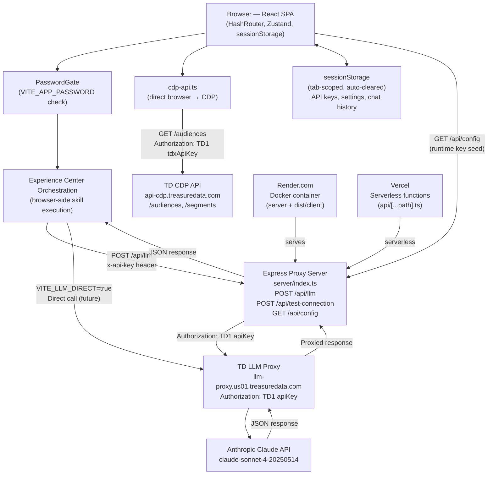
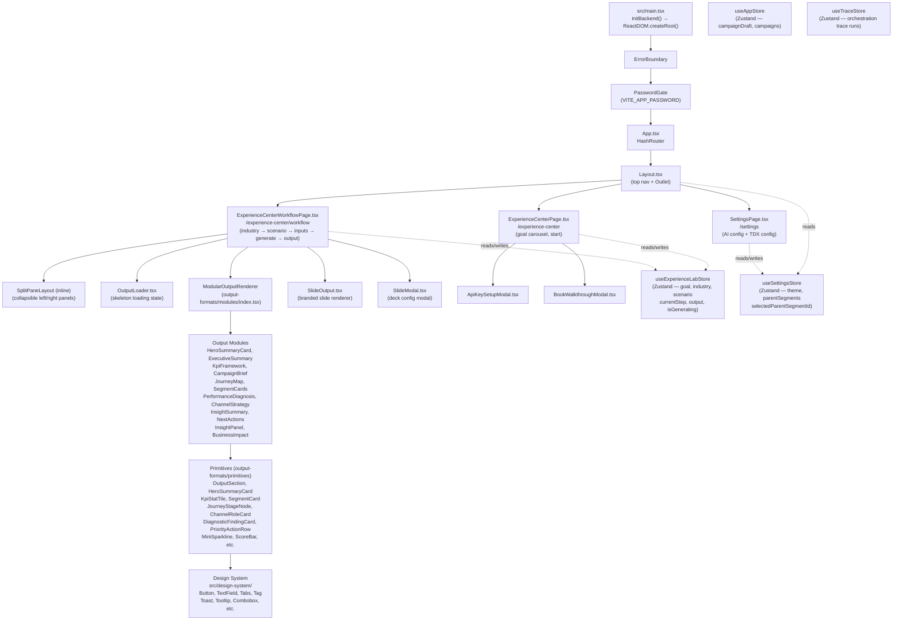
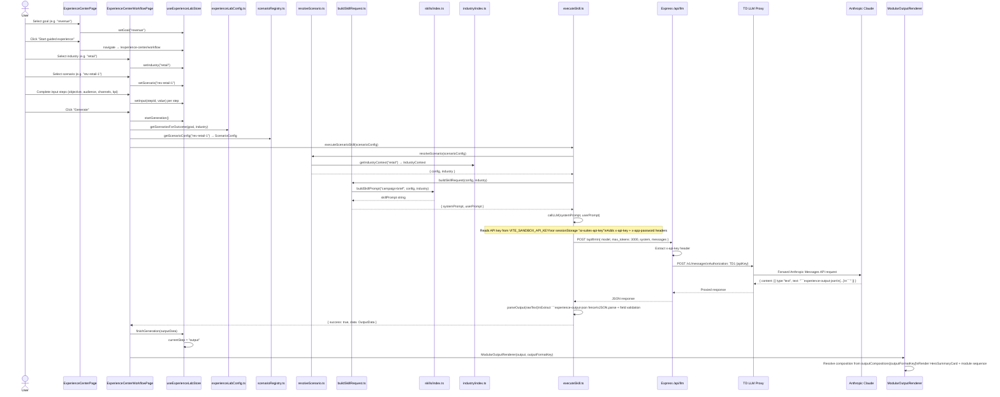
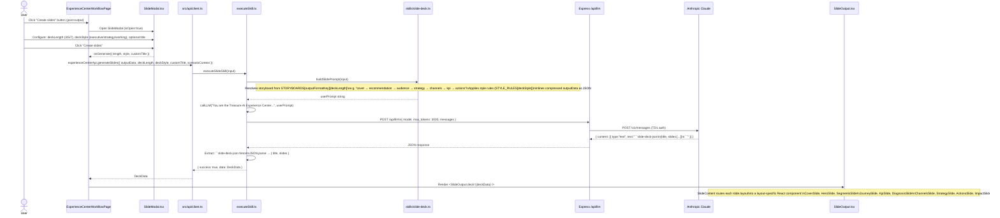

# Treasure AI Experience Center — Architecture Document

> Generated: 2026-03-31. Based on full codebase review and PR history.

---

## Table of Contents

1. [Overview](#1-overview)
2. [High-Level Architecture Diagram](#2-high-level-architecture-diagram)
3. [Frontend Architecture](#3-frontend-architecture)
4. [Orchestration & LLM Data Flow](#4-orchestration--llm-data-flow)
5. [Slide Generation Flow](#5-slide-generation-flow)
6. [CDP Integration](#6-cdp-integration)
7. [Security & Privacy Architecture](#7-security--privacy-architecture)
8. [Deployment Architecture](#8-deployment-architecture)
9. [Configuration Reference](#9-configuration-reference)
10. [Evolution & Key Design Decisions](#10-evolution--key-design-decisions)

---

## 1. Overview

The **Treasure AI Experience Center** is a public-facing, zero-login web application that lets enterprise marketers experience Treasure AI capabilities through a guided, scenario-driven workflow. A visitor selects a business goal (e.g. "Increase revenue"), an industry vertical (Retail, CPG, Travel), and a specific use-case scenario from a library of 36 pre-defined scenarios. The app then assembles a structured LLM prompt using industry-specific sample data and skill-family context, sends it to Anthropic's Claude model via Treasure Data's LLM Proxy, parses the structured JSON response, and renders a polished, multi-module output — including audience cards, channel strategy, KPI framework, next actions, and an insight panel. Users can optionally generate a branded presentation-ready slide deck from the same output. The app is designed as a PLG (Product-Led Growth) demand-generation tool: no signup, no API key required by the visitor (a sandbox key is pre-embedded), just a URL.

**Persona & user journey:** A marketing manager or CMO at an enterprise brand visits the URL (shared by a sales rep or from a campaign). They are optionally shown a password gate (casual filter only). On the landing page they choose a goal from an auto-scrolling carousel, click "Start guided experience," select their industry, pick a scenario, optionally refine inputs through a short questionnaire, and within 10–20 seconds receive a full structured AI recommendation. They can then iterate by clicking refinement chips, generate a slide deck, or book a sales walkthrough.

---

## 2. High-Level Architecture Diagram



> **Note:** The `VITE_LLM_DIRECT=true` path (direct browser-to-LLM-proxy calls) is prepared in the code but not yet active in production. It requires CORS support on the TD LLM Proxy endpoint, tracked as a separate infrastructure task.

---

## 3. Frontend Architecture



**Key notes:**

- `HashRouter` is used so the app works when served from a static file server without server-side routing support.
- `initBackend()` runs before React renders and sets `window.aiSuites = webBackend`. This is a compatibility shim so code written for an Electron IPC backend works unchanged in the web context.
- `PasswordGate` wraps the entire app tree and blocks rendering until the correct `VITE_APP_PASSWORD` is entered (or if no password is configured, passes through immediately).
- `ExperienceCenterWorkflowPage.tsx` is the largest file and contains the entire multi-step workflow state machine (industry → scenario → inputs → generating → output). The `SplitPaneLayout` is defined inline in the same file after a comment noting the original component was deleted.
- `useTraceStore` is present in the codebase but appears to be unused in the current Experience Center flow. It was likely carried over from an earlier multi-agent orchestration design.

---

## 4. Orchestration & LLM Data Flow



**Orchestration layer file map:**

| File | Role |
|------|------|
| `src/experience-center/registry/scenarioRegistry.ts` | Source of truth for all 36 scenarios (scenarioId → ScenarioConfig) |
| `src/experience-center/registry/skillFamilies.ts` | Defines 5 skill families and their default output module lists |
| `src/experience-center/orchestration/resolveScenario.ts` | Pairs ScenarioConfig with its IndustryContext |
| `src/experience-center/orchestration/buildSkillRequest.ts` | Assembles systemPrompt + userPrompt including output schema |
| `src/experience-center/orchestration/skills/index.ts` | Dispatches to per-skill-family prompt builders |
| `src/experience-center/orchestration/skills/campaign-brief.ts` | Prompt builder for campaign-brief skill family |
| `src/experience-center/orchestration/skills/journey.ts` | Prompt builder for journey skill family |
| `src/experience-center/orchestration/skills/segment-opportunity.ts` | Prompt builder for segment-opportunity skill family |
| `src/experience-center/orchestration/skills/performance-analysis.ts` | Prompt builder for performance-analysis skill family |
| `src/experience-center/orchestration/skills/insight-summary.ts` | Prompt builder for insight-summary skill family |
| `src/experience-center/orchestration/industry/retail.ts` | Hardcoded retail sample data (segments, metrics, channels, terminology) |
| `src/experience-center/orchestration/industry/cpg.ts` | Hardcoded CPG sample data |
| `src/experience-center/orchestration/industry/travel.ts` | Hardcoded travel sample data |
| `src/experience-center/orchestration/executeSkill.ts` | Entry point: resolves → builds → calls LLM → parses → returns |

**Output schema:** The LLM is instructed to return a JSON object wrapped in a ` ```experience-output-json ` code fence. The schema enforces: `summaryBanner`, `executiveSummary`, `audienceCards` (exactly 3), `channelStrategy`, `scenarioCore`, `kpiFramework` (exactly 4, with `trend` sparkline array), `nextActions` (exactly 5), and `insightPanel`. `parseOutput()` in `executeSkill.ts` extracts the fence, `JSON.parse`s it, and normalises any non-array fields the LLM may have returned incorrectly.

> **Note:** `src/services/experienceLabOutputs.ts` contains a fully hardcoded fallback output generator that does not call the LLM at all. It is used as a reference / emergency fallback but is not wired into the current primary flow, which always calls the LLM.

---

## 5. Slide Generation Flow



**Storyboard resolution:** `buildSlidePrompt()` in `src/experience-center/orchestration/skills/slide-deck.ts` maintains a `STORYBOARDS` map keyed by `outputFormatKey` (e.g. `campaign_brief`, `journey_map`, `segment_cards`) and `deckLength` (3, 5, or 7). This tells Claude the exact slide sequence to generate. Example for `campaign_brief` at 7 slides: `cover → recommendation → audience → strategy → channels → kpi → actions`.

**Slide layouts:** 10 named layouts — `cover`, `hero`, `segments`, `journey`, `kpi`, `diagnosis`, `channels`, `strategy`, `actions`, `impact`. Each has a typed data contract defined in `src/experience-center/output-formats/slides/types.ts` and a corresponding React component in `SlideOutput.tsx`. The `SlideContent` function routes `slide.layout` to the correct component.

**Loading state:** `OutputLoader.tsx` with `variant="slides"` renders a `SlideSkeleton` component with a cycling status message ("Preparing slide outline", "Mapping content to slides", etc.) while the LLM call is in flight.

---

## 6. CDP Integration

### API key and endpoint

The TDX API key is read from two possible sources (in priority order):
1. `sessionStorage` key `ai-suites-tdx-api-key` (set by the user in Settings or seeded from `/api/config` at startup)
2. `import.meta.env.VITE_SANDBOX_API_KEY` (build-time baked key for sandbox deployments)

The CDP endpoint is derived from the user's selected region stored in `sessionStorage` under `ai-suites:settings` → `tdxEndpoint`. The `getCdpEndpoint()` function in `cdp-api.ts` rewrites `api.treasuredata.com` → `api-cdp.treasuredata.com` automatically. Default: `https://api-cdp.treasuredata.com`.

### Direct browser calls (no proxy)

Unlike LLM calls, CDP API calls go **directly from the browser** to `api-cdp.treasuredata.com`. The TD CDP API supports CORS, so no server proxy is needed. The `Authorization: TD1 {apiKey}` header is sent directly from the browser.

```
Browser → GET api-cdp.treasuredata.com/audiences
          Authorization: TD1 {tdxApiKey}

Browser → GET api-cdp.treasuredata.com/audiences/{parentId}/segments
          Authorization: TD1 {tdxApiKey}
```

### What data is fetched

| Endpoint | Data returned | Used for |
|----------|---------------|----------|
| `GET /audiences` | List of parent segments (id, name, population, description, masterTable) | `useSettingsStore.fetchParentSegments()` — populates parent segment selector in UI |
| `GET /audiences/{id}/segments` | Nested child segments, flattened with folderPath | `cdp-api.fetchChildSegments()` — exposed via `window.aiSuites.audiences.list()` and `settings.parentSegmentChildren()` |

The fetched parent/child segments appear in the `useSettingsStore` (`parentSegments[]`, `selectedParentSegmentId`). The selected parent segment is persisted back to `sessionStorage` via `window.aiSuites.settings.set({ selectedParentSegmentId })`.

### Sample data vs. real TDX data

**Current state (as of 2026-03-31):** LLM prompts use entirely hardcoded sample data from `src/experience-center/orchestration/industry/*.ts` (retail, cpg, travel). Real TDX segment names and population counts are **not** currently injected into LLM prompts. The CDP integration fetches real segments for display in the UI sidebar but does not yet pass them to the LLM.

> **Note:** The `docs/legal-security-privacy-review.md` document explicitly calls out a planned transition where real TDX segment metadata will be included in LLM prompts. This has privacy and data processing agreement implications (see Section 7).

---

## 7. Security & Privacy Architecture

### sessionStorage-only data (privacy by architecture)

All user data (API keys, settings, chat history, session state) is stored exclusively in `sessionStorage` via the `src/utils/storage.ts` wrapper. `sessionStorage` is:
- **Tab-scoped**: data is not shared across tabs or browser windows
- **Auto-cleared**: all data is destroyed when the tab is closed
- **Never persisted to a server**: the Express proxy is stateless and writes nothing to disk

This means there is no cross-user data leakage risk on the server side. PR #2 ("Refactor to browser-only architecture") explicitly cites "privacy by architecture" as the motivation for this design.

**sessionStorage keys in use:**

| Key | Content |
|-----|---------|
| `ai-suites-api-key` | LLM proxy API key |
| `ai-suites-tdx-api-key` | TDX CDP API key |
| `ai-suites:settings` | Model, LLM proxy URL, TDX endpoint, TDX database |
| `ai-suites:chat-history` | Chat conversation history (multi-turn) |
| `ai-suites:saved-chats` | Named saved chats |
| `ai-suites:blueprints` | Saved blueprint objects |
| `app_authenticated_v2` | Whether the password gate has been passed |

### App password guard

`VITE_APP_PASSWORD` is embedded in the JavaScript bundle at build time. `PasswordGate.tsx` checks the entered password against this constant. The code and the legal review document both explicitly state: **this is a casual visitor filter only, not real security**. Anyone who inspects the bundle source can extract the password. This is acceptable because the sandbox API key has its own rate limiting and the app is designed as a public-facing demo.

The server also has a separate `APP_PASSWORD` environment variable checked via an Express middleware on all `/api/*` routes. Client code sends this as the `x-app-password` request header. The two passwords are set to the same value in `render.yaml` (`TDsuperhuman`).

### API key handling

The flow for LLM API key usage:

1. **Build time (Vercel/static):** `VITE_SANDBOX_API_KEY` is baked into the JS bundle. All users share this key. No key entry required.
2. **Runtime (Docker/Render):** `GET /api/config` endpoint (registered before the password gate middleware) returns `{ sandboxApiKey }` from the server's `process.env.API_KEY`. `initBackend()` in `backend.ts` seeds this into `sessionStorage` before React renders. This solves the problem where `VITE_` env vars cannot be set at Render dashboard runtime (they require a rebuild).
3. **Manual entry:** Users can enter their own key in Settings. It is saved to `sessionStorage` and sent as `x-api-key` on every `/api/llm` request.

The Express proxy receives the key as the `x-api-key` request header and adds the `Authorization: TD1 {apiKey}` header required by the TD LLM Proxy. **The raw API key is never logged by the proxy server.**

### CORS and `VITE_LLM_DIRECT` flag

The `VITE_LLM_DIRECT=true` build-time flag in `executeSkill.ts` switches LLM calls from routing through `/api/llm` to calling `TD LLM Proxy` directly from the browser. In direct mode, the browser sends `Authorization: TD1 {apiKey}` directly. This flag was added in PR #8 to prepare for a future state where the TD LLM Proxy adds CORS support, enabling full static deployment (no Express server needed). As of now, the flag is not set in production; all LLM calls go through the proxy.

The Express server sets `cors()` (allow all origins, `*`) with no restrictions. This is noted as an open question in the legal/security review.

### Sample data only in LLM prompts

The system prompt includes this explicit statement: "All outputs use sample data and should be framed as illustrative recommendations that showcase Treasure AI capabilities." Industry context objects (`retail.ts`, `cpg.ts`, `travel.ts`) contain hardcoded fictional sample segments, metrics, and channel preferences. No real customer data or PII is included in LLM prompts in the current implementation.

### Deployment secrets

Render environment variables (set in the Render dashboard, not committed to git):
- `VITE_SANDBOX_API_KEY` (marked `sync: false` in `render.yaml` — not synced from file, must be set manually in Render dashboard)
- `APP_PASSWORD` / `VITE_APP_PASSWORD` (set to `TDsuperhuman` in `render.yaml`)
- `NODE_ENV=production`

> **Note:** The `.env` file in the repository root contains a real API key (`13232/be115c8ce956db64a6116b9c760002cf93684765`). This file is not in `.dockerignore` but should not be committed to git in production scenarios. For a public repo this would be a credential leak. The `.env.example` is the safe version to share.

### What data leaves the browser and where it goes

| Data | Destination | Notes |
|------|-------------|-------|
| LLM prompt (system + user messages, includes hardcoded industry sample data) | Browser → Express proxy → TD LLM Proxy → Anthropic Claude | No real customer PII currently. Anthropic DPA applicability is an open question per legal review |
| API key (`x-api-key` header) | Browser → Express proxy only | Proxy converts to `TD1` auth and forwards; key never logged |
| TDX API key | Browser → api-cdp.treasuredata.com only | Direct browser call, never to Express proxy |
| CDP segment data (names, population counts) | api-cdp.treasuredata.com → Browser | Stays in browser sessionStorage. Currently not forwarded to LLM |
| Chat messages | Browser → Express proxy → TD LLM Proxy | Multi-turn; history in sessionStorage only |
| Booking form data (name, email, company, role) | Not sent anywhere yet | Backend integration planned; currently a UI placeholder |

---

## 8. Deployment Architecture

```mermaid
graph TD
    subgraph LocalDev["Local Development"]
        ViteServer["Vite Dev Server\nport 5175\nvite.web.config.ts\n(proxies /api → :3001)"]
        TSXWatch["tsx watch server/index.ts\nport 3001"]
        Concurrently["npm run dev\n(concurrently)"]
        Concurrently --> ViteServer
        Concurrently --> TSXWatch
    end

    subgraph RenderDeploy["Render Deployment (Primary)"]
        DockerBuild["Docker Build\nnode:22 base\nnpm install\nnpm run build:client\n(VITE_APP_PASSWORD + VITE_SANDBOX_API_KEY\nbaked in as build args)"]
        DockerRun["Docker Run\nnpx tsx server/index.ts\nport 3001\nserves dist/client as static"]
        RenderEnv["Render Env Vars\nAPP_PASSWORD, VITE_APP_PASSWORD\nVITE_SANDBOX_API_KEY (sync:false)\nNODE_ENV=production"]
        DockerBuild --> DockerRun
        RenderEnv --> DockerBuild
        RenderEnv --> DockerRun
    end

    subgraph VercelDeploy["Vercel Deployment (Alternative)"]
        VercelBuild["npm run build:vercel\nVite build → dist/client"]
        VercelFunc["api/[...path].ts\nServerless function\nimports Express app\nmaxDuration: 60s"]
        VercelRoutes["vercel.json routes\n/api/* → serverless fn\n/* → index.html"]
        VercelBuild --> VercelFunc
        VercelFunc --> VercelRoutes
    end

    subgraph StaticFuture["Future: Static CDN (post-CORS)"]
        StaticFiles["dist/client static files\n(no server needed)"]
        LLMDirect["VITE_LLM_DIRECT=true\nBrowser → TD LLM Proxy directly"]
        StaticFiles --> LLMDirect
    end
```



**Build scripts (`package.json`):**

| Script | What it does |
|--------|-------------|
| `npm run dev` | `concurrently` starts `tsx watch server/index.ts` (port 3001) and `vite --config vite.web.config.ts` (port 5175) |
| `npm run build:client` | `vite build --config vite.web.config.ts` → `dist/client/` |
| `npm run build:server` | `tsc -p tsconfig.server.json` → `dist/server/` (used for `npm start`) |
| `npm run build:vercel` | Same as `build:client` (alias used in `vercel.json`) |
| `npm start` | `node dist/server/index.js` (requires pre-built server) |

**Docker specifics (`Dockerfile`):**
- Base image: `node:22`
- Installs `git` and `ripgrep` (carried over from an earlier Claude Code subprocess use)
- Build args `VITE_APP_PASSWORD` and `VITE_SANDBOX_API_KEY` are passed at build time and baked into the client bundle via Vite
- Runtime: `npx tsx server/index.ts` (runs TypeScript server directly, avoiding a separate compile step)
- Exposes port 3001; `NODE_OPTIONS="--max-old-space-size=512"` caps memory usage

**Vercel specifics (`vercel.json`):**
- `api/[...path].ts` is a catch-all serverless function that imports the Express `app` from `server/index.ts` and exports it as the default handler
- The Express server detects `process.env.VERCEL` and skips `app.listen()` (serving static files is handled by Vercel's CDN)
- Max function duration: 60 seconds (for LLM call timeout headroom)

---

## 9. Configuration Reference

| Variable | Purpose | Used by | Build-time or Runtime | Required |
|----------|---------|---------|----------------------|----------|
| `API_KEY` | LLM proxy API key served from `/api/config` endpoint at runtime | Server (`server/index.ts`) | Runtime | For Docker/Render deploys without build-time key baking |
| `LLM_PROXY_URL` | Override the default TD LLM Proxy URL | Server (`server/index.ts`) | Runtime | No (default: `https://llm-proxy.us01.treasuredata.com`) |
| `MODEL` | Override Claude model (unused in current server code, noted in `.env.example`) | Not currently referenced in server | Runtime | No |
| `APP_PASSWORD` | Server-side password gate for all `/api/*` routes | Server (`server/index.ts`) | Runtime | No (gate disabled if unset) |
| `PORT` | HTTP port for the Express server | Server (`server/index.ts`) | Runtime | No (default: `3001`) |
| `VITE_SANDBOX_API_KEY` | Sandbox API key baked into the client bundle; used for both LLM and TDX calls when no user-entered key exists | Client (`executeSkill.ts`, `web-backend.ts`, `cdp-api.ts`, `api/client.ts`, `chat-client.ts`) | Build-time (also available at runtime via `/api/config`) | No (users prompted to enter key if absent) |
| `VITE_APP_PASSWORD` | Password baked into client bundle for `PasswordGate.tsx` | Client (`PasswordGate.tsx`, `executeSkill.ts`, `web-backend.ts`, `chat-client.ts`) | Build-time | No (gate disabled if unset) |
| `VITE_LLM_DIRECT` | When `"true"`, bypasses Express proxy and calls TD LLM Proxy directly from browser | Client (`executeSkill.ts`) | Build-time | No (default: routes through proxy) |
| `VITE_LLM_PROXY_URL` | Override the TD LLM Proxy URL for direct browser calls (`VITE_LLM_DIRECT=true` mode) | Client (`executeSkill.ts`) | Build-time | No (default: `https://llm-proxy.us01.treasuredata.com`) |
| `VITE_API_BASE` | Override the API base path for server calls | Client (`executeSkill.ts`, `web-backend.ts`, `api/client.ts`, `chat-client.ts`) | Build-time | No (default: `/api`) |
| `NODE_ENV` | Standard Node environment flag | Server | Runtime | No (set to `production` in Render) |
| `VERCEL` | Auto-set by Vercel; suppresses `app.listen()` in server | Server (`server/index.ts`) | Runtime | No (auto-injected by Vercel) |

> **Note:** `VITE_` prefixed variables are baked into the client JavaScript bundle by Vite at build time. They are visible to anyone who inspects the bundle source. Do not use them for secrets that must remain confidential. For the sandbox deployment model this is an accepted trade-off documented in `docs/legal-security-privacy-review.md`.

---

## 10. Evolution & Key Design Decisions

Based on PR history (PRs #1–#16, all merged by 2026-03-31):

### Why sessionStorage over localStorage (PR #2)

The original app used `localStorage` for all user data. PR #2 ("Refactor to browser-only architecture") migrated 27 files from `localStorage` to `sessionStorage` via the `src/utils/storage.ts` wrapper. The stated reason: **"Privacy by architecture — eliminate server-side state to prevent cross-user data leakage when hosted on public website for anonymous users."** `sessionStorage` auto-clears on tab close, ensuring no data persists between sessions and no shared state is possible between concurrent anonymous visitors.

### Why the proxy server exists (TD1 auth header injection) (PR #2)

The Anthropic Messages API expects `Authorization: Bearer sk-...` but the TD LLM Proxy requires `Authorization: TD1 {apiKey}` (Treasure Data's proprietary auth scheme). Browsers cannot be trusted to hold API keys securely in source code, and placing the `TD1` conversion logic client-side would expose the key transformation to inspection. The Express proxy (`server/index.ts`) provides a thin translation layer: the browser sends `x-api-key: {key}` and the proxy rewrites this to `Authorization: TD1 {key}` when forwarding to the TD LLM Proxy. This keeps the auth header conversion server-side, reducing the surface area for key theft.

### Why orchestration moved to the browser (PR #2)

In the original architecture, the Experience Center orchestration (scenario resolution, prompt building, LLM calling) ran on the Express server. PR #2 ported the entire orchestration layer to `src/experience-center/orchestration/` as browser-side TypeScript. The rationale: "to prepare for fully static deployment" (PR #8's goal). With orchestration in the browser, the server is reduced to a single stateless proxy file. The only remaining server responsibility is auth header injection; everything else — scenario registry, prompt assembly, LLM response parsing, output rendering — runs client-side.

### Why the Agent SDK was removed (PR #8)

The original server had `server/services/claude-agent.ts` which wrapped the `@anthropic-ai/claude-agent-sdk` with session management and SSE streaming, and `server/routes/chat.ts` which exposed SSE endpoints. PR #8 ("Prepare for fully static deployment") deleted these entirely with the observation that "the Experience Center only uses `/api/llm` for scenario generation via `executeScenarioSkill()` — it never used the Agent SDK chat sessions." A simpler `src/services/chat-client.ts` replaced the Agent SDK with direct Messages API calls (multi-turn, no streaming, no tools). This removed one major server-side dependency (`@anthropic-ai/claude-agent-sdk`) and reduced the bundle by removing 40 packages (`recharts` was also removed in PR #10 after confirming zero imports).

### Why `VITE_LLM_DIRECT` was added (PR #8)

The long-term deployment goal is to serve the Experience Center as fully static files from Marketing's CDN — eliminating the Express server (and its Render hosting cost) entirely. The only server-side dependency blocking this is the TD LLM Proxy's lack of CORS headers. `VITE_LLM_DIRECT=true` was added as a one-line switch: when the TD LLM Proxy adds CORS support (tracked separately), switching to static deployment requires only setting this env var at build time. Until that infrastructure work is complete, the Render proxy continues to work as-is.

### Why the app was stripped to Experience Center only (PR #4)

The repository originally contained three AI suites: Experience Center, Personalization AI Suite, and Paid Media AI Suite. PR #4 deleted 20+ suite pages, 9 component directories, 19 stores, and 17 services — reducing the main bundle from 3,383 KB to 435 KB (87% reduction). The rationale was to create a focused, fast-loading PLG landing experience rather than a feature-complete product demo. `App.tsx` was simplified to 3 routes.

### Why the `/api/config` runtime endpoint was added (PR #12)

`VITE_` prefixed environment variables in Vite are baked into the JavaScript bundle at build time. In Docker deployments on Render, the Docker image is built at deploy time, but Render's dashboard allows setting environment variables that take effect at container startup without a rebuild. Setting `VITE_SANDBOX_API_KEY` in the Render dashboard would have no effect because the variable is consumed during the Vite build that already happened. The `/api/config` endpoint (registered before the password gate middleware so it's always accessible) reads `process.env.API_KEY` at runtime and returns it to the client. `initBackend()` fetches this endpoint before React renders and seeds `sessionStorage`. This allows the sandbox API key to be rotated by updating the Render dashboard environment variable and restarting the container, without requiring a full rebuild and redeploy.

### Why the Personalization and Paid Media suites were retained in some dead code (observation)

`src/stores/appStore.ts` still references `Campaign`, `ContentSpot`, and `Segment` types from `src/types/shared` and holds a `campaignDraft` state. This is dead code — the Experience Center does not use `useAppStore` in any active component. It appears to be a residual from the pre-PR-#4 multi-suite architecture that was not fully cleaned up. Similarly, `useTraceStore` exists but is not connected to the current orchestration flow.
