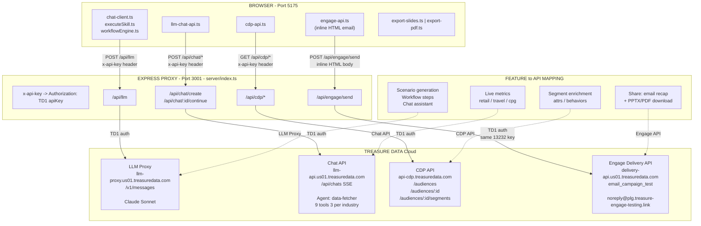

# Experience Center — Browser-Side API Architecture

> All TD APIs proxied through Express to avoid CORS. Keys live in browser sessionStorage.

## Color Legend

| Color | API Path | Files |
|-------|----------|-------|
| Deep Blue `#2D40AA` | **LLM Proxy** — scenario generation, workflow steps | `executeSkill.ts`, `workflowEngine.ts`, `chat-client.ts` |
| Orchid `#C466D4` | **Chat API** — live metrics via AI Foundry agent | `llm-chat-api.ts` |
| Sky Blue `#80B3FA` | **CDP API** — segment enrichment, attrs, behaviors | `cdp-api.ts` |
| Purple `#847BF2` | **Engage API** — email recap with inline HTML | `engage-api.ts` |
| Peach `#FDB893` | **Browser-only export** — PPTX + PDF generation (no server) | `export-slides.ts`, `export-pdf.ts` |

## API Details

| Route | Upstream | Auth | Purpose |
|-------|----------|------|---------|
| `POST /api/llm` | `llm-proxy.us01.treasuredata.com/v1/messages` | TD1 | Claude Sonnet — all LLM calls (workflow steps, scenario generation, slide decks) |
| `POST /api/chat/create` | `llm-api.us01.treasuredata.com/api/chats` | TD1 | Create agent chat session |
| `POST /api/chat/:id/continue` | `llm-api.us01.treasuredata.com/api/chats/:id/continue` | TD1 | Send message to agent (SSE streaming) |
| `GET /api/cdp/*` | `api-cdp.treasuredata.com/*` | TD1 | Parent segments, child segments, attributes, behaviors |
| `POST /api/engage/send` | `delivery-api.us01.treasuredata.com/api/email_transactions/email_campaign_test` | TD1 | Send inline HTML email via Engage |
| `GET /api/config` | — | — | Returns sandbox API key at runtime (for Docker deploys) |

> **Note:** PPTX and PDF generation happens entirely in the browser using `pptxgenjs` and `jsPDF`. No server call or LLM call is made — the export reformats existing workflow step data into the output format.
