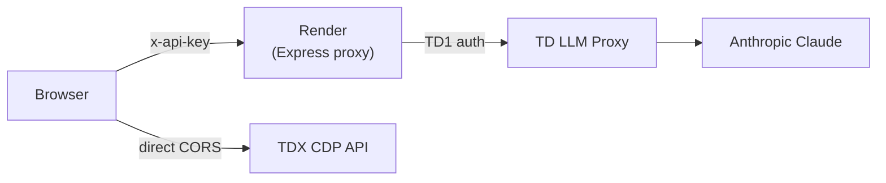
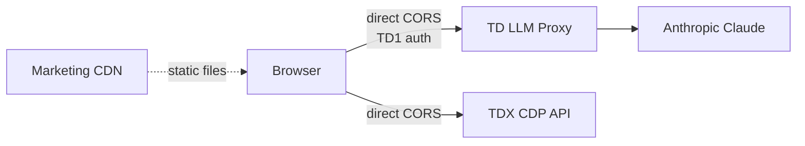
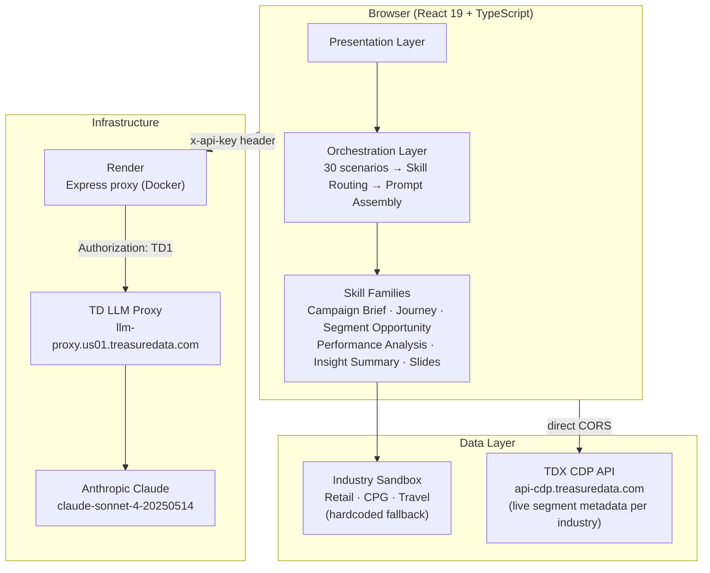
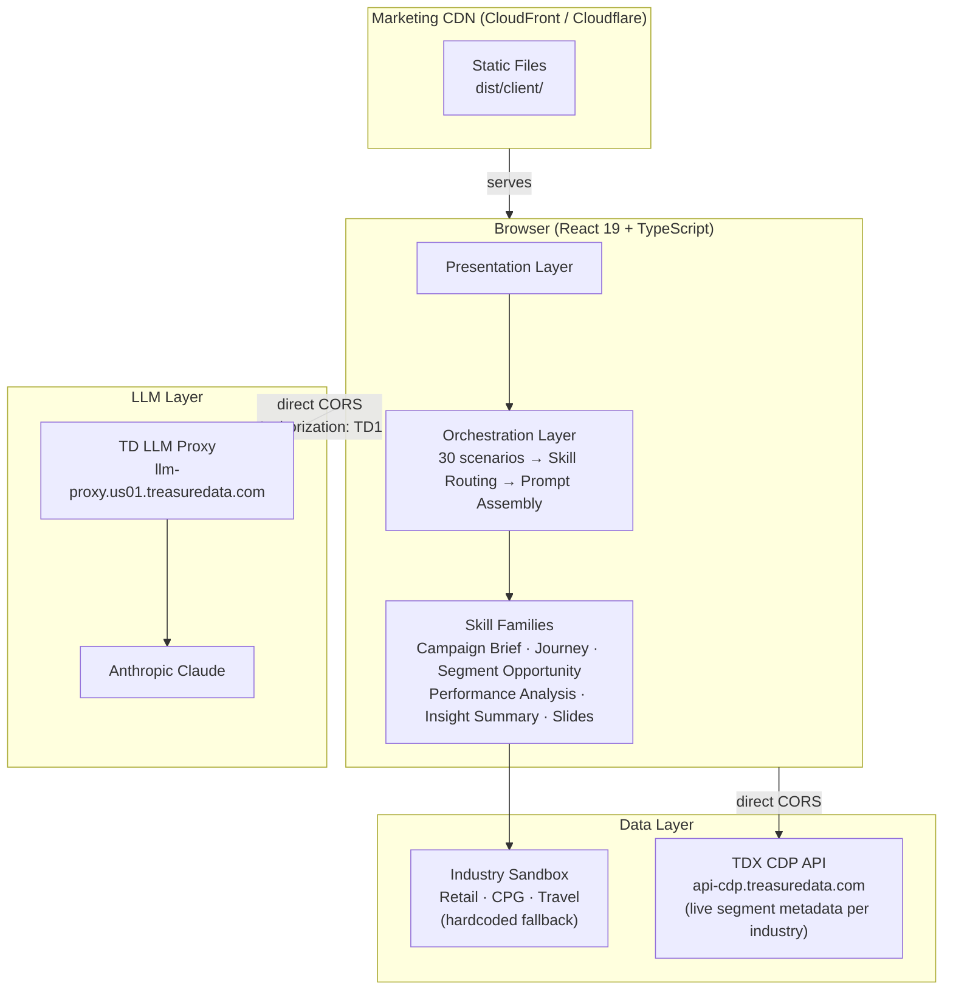

# Experience Center -- Legal, Security & Privacy Review Topics

Prepared for cross-functional review meeting. This document outlines the key topics and questions based on the Experience Center's current architecture and public deployment model.

> **Last updated:** 2026-04-01 (reflects latest `main` including PR #18 remove-app-password, PR #19 cursor-change)

---

## 1. API Key Exposure

**Current state:**
- A shared sandbox TD API key (`VITE_SANDBOX_API_KEY`) is embedded in the client JS bundle at Vite build time and is extractable by anyone who inspects the source
- The same key is also served at runtime via an unauthenticated `GET /api/config` endpoint (used for Docker/Render deploys where build-time env vars aren't available)
- The key is stored in browser `sessionStorage` under the key `ai-suites-api-key`
- The key is sent to the Express server as an `x-api-key` HTTP header; the server converts it to a `TD1` Authorization header before forwarding to the TD LLM Proxy

**Planned mitigations:**
- The sandbox TD account is intended to have: a spending cap on LLM usage, read-only minimum-scope permissions for CDP, and access to only synthetic/demo data (no real customer data)
- These restrictions have not yet been confirmed as implemented

**Questions:**
- What is the acceptable risk level for a shared sandbox API key visible in the JS bundle?
- Should we implement key rotation policies for the sandbox key?
- Should the `/api/config` endpoint be rate-limited or restricted?
- Have the sandbox key scope restrictions been applied? (spending cap, read-only CDP, demo data only)

---

## 2. No Authentication / Public Access

**Current state:**
- The app is designed as a "no-auth entry" experience -- zero login required (explicit design principle)
- **The client-side password gate (`PasswordGate.tsx`) has been removed** (PR #18) -- there is no visitor filtering of any kind
- The server-side optional password middleware still exists in code (`APP_PASSWORD` env var) but is **disabled** (env var is empty/unset)
- Anyone with the URL can access the full experience and trigger LLM calls immediately

**Decision history:** Prompt #2 (architecture cleanup) recommended either removing the password gate or accepting it as a casual-visitor filter only. PR #18 removed it from the client. The server-side `APP_PASSWORD` middleware remains as dead code.

**Questions:**
- Is a fully public app (no password, no login) calling the TD LLM Proxy acceptable?
- Who is liable if the sandbox API key is extracted and used outside the app?
- Do we need IP-based rate limiting, WAF protection, or other abuse prevention given there is now zero access barrier?
- Should the remaining server-side `APP_PASSWORD` middleware be cleaned up from the codebase?

---

## 3. LLM Proxy Usage & Cost

**Current state:**
- Every visitor can trigger Claude API calls via the TD LLM Proxy at Treasure Data's cost
- **No rate limiting exists today** -- neither server-side (no `express-rate-limit`) nor via the TD LLM Proxy
- **Planned:** Per-API-key rate limiting on the TD LLM Proxy is being implemented by Nahi and Leo (target: Apr 20). This will be the primary abuse prevention mechanism -- rate limiting will be enforced at the proxy layer, not in the Express server
- Each scenario generation makes 1 LLM call (~3,000 max tokens); slide generation adds a 2nd call
- The chat interface (`chat-client.ts`) makes additional LLM calls (4,096 max tokens each) with full conversation history
- Model used: `claude-sonnet-4-20250514`
- Skill execution timeout: 90 seconds; connection test timeout: 15 seconds

**Questions:**
- What usage limits should be enforced? (per-IP, per-session, per-key?)
- Who owns the cost for public usage of the LLM proxy?
- What is the abuse risk now that there is zero access barrier? (automated scraping, bot traffic, prompt injection)
- Should we cap requests per session or per IP?
- Is a 50MB JSON body limit (`express.json({ limit: '50mb' })`) appropriate, or should it be reduced?

---

## 4. Data Sent to Claude / Anthropic

**Current state:**
- **Hardcoded industry sandbox data** is included in every LLM prompt: sample segment names, population sizes, KPI benchmarks, channel preferences, and industry-specific terminology for 3 verticals (Retail, CPG, Travel)
- **Live CDP segment metadata** is sent to the LLM when an industry-specific parent segment is selected: segment names, descriptions, population counts, attribute group names, behavioral data source names, and derived channel preferences. This data comes from `api-cdp.treasuredata.com` via direct browser calls. Currently wired for retail; all industries (CPG, Travel) are being connected to their own parent segments
- **No raw customer PII** is sent -- only aggregate metadata (segment names, population counts, attribute schema)
- LLM responses (AI-generated marketing recommendations) are returned to the browser as structured JSON
- The system prompt frames all output as "illustrative recommendations that showcase Treasure AI capabilities"

**What the LLM receives per call:**
1. System prompt with skill-specific instructions + JSON output schema
2. Scenario configuration (title, description, KPI, strategic intent)
3. Industry context (6 sample segments, metrics, channels, terminology)
4. Optional: live CDP segment metadata (per-industry parent segments, with hardcoded fallback if CDP connection fails)

**Questions:**
- Does any live CDP segment metadata (names, population counts, attribute group names) constitute PII or customer-identifiable information?
- Is sending CDP segment metadata to Anthropic's API compliant with our data processing agreements?
- Does Anthropic's data retention policy (training data opt-out, etc.) align with Treasure Data's requirements?
- Do we have a Data Processing Agreement (DPA) with Anthropic that covers this use case?
- Should we audit the default parent segments for each industry to confirm their data is safe for public demo use?

---

## 5. Client-Side Data Storage

**Current state:**
- All client data is stored in browser `sessionStorage` only -- auto-clears when the tab closes
- **No cookies, no localStorage, no persistent storage, no cross-session tracking**
- **No analytics or tracking scripts** -- no gtag, no Segment, no Mixpanel, no pixels

**Data stored in sessionStorage:**

| Key | Contents | Sensitive |
|-----|----------|-----------|
| `ai-suites-api-key` | LLM proxy API key | Yes |
| `ai-suites-tdx-api-key` | TDX CDP API key | Yes |
| `ai-suites:settings` | Model, max tokens, TDX endpoint | Partial |
| `ai-suites:chat-history` | Conversation history | No |
| `ai-suites:saved-chats` | Named saved chat sessions | No |
| `ai-suites:blueprints` | Saved blueprint configurations | No |

**Questions:**
- Is sessionStorage-only storage sufficient for privacy compliance?
- Do we need a cookie/privacy banner even without cookies? (Some jurisdictions require disclosure for any client-side storage)
- Are there any GDPR/CCPA implications for the current approach?

---

## 6. Lead Capture -- Book a Walkthrough

**Current state:**
- The booking form (`BookWalkthroughModal.tsx`) collects PII: first name, last name, work email, company, role/title, and an optional message
- **No backend exists** -- form submission is simulated with an 800ms client-side timeout. Data is not sent to any server, API, or database
- A backend integration (email, webhook, or CRM) is planned
- Separately, an "email export" feature (`EmailCaptureCard`) collects a work email address but only triggers a **local browser download** of a `.txt` file -- the email address is not transmitted anywhere

**Questions:**
- When we add a backend, where should lead data be stored and for how long?
- What consent language is required on the form?
- Do we need a link to a privacy policy?
- What are our GDPR right-to-delete obligations for collected lead data?
- Does the form need a checkbox for marketing consent?

---

## 7. Third-Party Services & Data Flow

**Current state (interim):**
- **Render** (render.com) -- hosts the Docker container (Express server + React client)
- **TD LLM Proxy** (llm-proxy.us01.treasuredata.com) -- routes requests to Anthropic's Claude API
- **Anthropic (Claude)** -- processes LLM prompts and returns AI-generated output
- **TDX CDP API** (api-cdp.treasuredata.com) -- called **directly from the browser** (CORS-enabled) to fetch segment metadata

**Target state (post Apr 20):**
- **Marketing CDN** (CloudFront, Cloudflare, or similar) -- fully static files, no server component
- Browser calls TD LLM Proxy directly (CORS) and TDX CDP API directly (CORS already supported)
- Render is no longer needed -- the deliverable is `npm run build:static` → `dist/client/` handed to Marketing team
- Blocked on: TD LLM Proxy CORS support + per-API-key rate limiting (Nahi & Leo, target Apr 20)

**Data flow (current):**

**Data flow (target):**

**Deployment configuration:**
- Render: `render.yaml` + `Dockerfile`, API key set via dashboard (not in git)
- `VITE_LLM_DIRECT` flag already implemented -- when set to `true`, `executeSkill.ts` calls TD LLM Proxy directly instead of `/api/llm`. This is the switch for going fully static.

**Questions:**
- Is Render acceptable as interim hosting until the static CDN migration?
- What is the data residency situation? (Vercel/Render region, Anthropic processing location)
- Is the Anthropic DPA in place and does it cover public-facing demo applications?
- Are there compliance requirements for data flowing through the TD LLM Proxy?
- When the app moves to Marketing's CDN, does the CDN choice (CloudFront, Cloudflare, etc.) have compliance implications?

---

## 8. Content Liability -- AI-Generated Output

**Current state:**
- AI-generated marketing recommendations are presented as "illustrative recommendations that showcase Treasure AI capabilities" (per the system prompt)
- When using real CDP segments, the framing is the same -- outputs still use the "illustrative" framing since they are sample-data-augmented
- **Output types generated by the LLM:**
  - Campaign briefs (objective, audience, messaging, offer strategy, timeline, budget guidance)
  - Customer journey maps (4-5 stages with triggers, channels, messages, wait times)
  - Segment opportunity cards (3 audience segments with sizing, opportunity levels, activation actions)
  - Performance diagnoses (root cause analysis, optimization recommendations, impact forecasts)
  - Insight summaries (key findings, supporting evidence, strategic implications)
  - Slide decks (3-7 slides in executive/strategy/working styles)
  - KPI frameworks (4 metrics with types and projected trend data)
- All outputs follow a strict JSON schema enforced by the system prompt

**Questions:**
- Do we need disclaimers that AI-generated output is not guaranteed or actionable without review?
- What is our liability if a prospect acts on AI-generated recommendations?
- Who owns the intellectual property of the generated content?
- Should outputs include a visible "AI-generated" watermark or disclaimer?

---

## 9. Brand & External Visibility

**Current state:**
- The app uses Treasure Data branding ("Treasure AI Experience Lab") and is publicly accessible
- The design principle is a "no-login, public website" for lead generation
- The app is described as a tool for "enterprise marketers" to experience Treasure AI
- A custom gradient cursor has been added for brand differentiation (PR #19)

**Questions:**
- Does this need marketing/brand team approval before public launch?
- Is the "Treasure AI" naming approved for external use?
- Are there trademark considerations for the name or branding?
- Does the public nature require a Terms of Use page?

---

## 10. Security Hardening

**Current state:**

| Control | Status |
|---------|--------|
| `X-Frame-Options: SAMEORIGIN` | Configured in `public/_headers` |
| `X-Content-Type-Options: nosniff` | Configured in `public/_headers` |
| `Referrer-Policy: strict-origin-when-cross-origin` | Configured in `public/_headers` |
| Content Security Policy (CSP) | **Not implemented** |
| HTTP Strict Transport Security (HSTS) | **Not implemented** |
| `helmet` middleware | **Not used** |
| CORS | **Allow all origins** (`cors()` with defaults = `*`) |
| Rate limiting | **Not implemented today** -- planned on TD LLM Proxy side (per-API-key limits, Nahi & Leo, target Apr 20). No `express-rate-limit` on the server, and none needed if proxy-side limits are sufficient |
| Request body validation | **Not implemented** (LLM request body passed through as-is) |
| Request body size limit | 50MB (`express.json({ limit: '50mb' })`) |
| HTTPS enforcement | Handled by Render at platform level (Render enforces TLS) |
| Error message leakage | Generic errors only, no key/secret exposure |
| API key logging | None -- keys are not logged server-side |

**Questions:**
- Should we add CSP and HSTS headers?
- Should CORS be restricted to specific origins instead of `*`?
- Should `helmet` be added as Express middleware?
- Is the current security posture sufficient for a public-facing application with zero access barriers?
- Should we conduct a penetration test or security audit before launch?
- Should the 50MB body limit be reduced?
- Once the app moves to static deployment, do CORS and rate limiting on the TD LLM Proxy fully replace the need for server-side security controls?

---

## Architecture Reference

**Current architecture (interim -- Render with Express proxy):**

**Target architecture (post Apr 20 -- fully static, no server):**

## Key Design Principles

- **No-auth entry** -- zero friction, no login, no password gate
- **Web-first** -- no downloads, no installs, just a URL
- **Sandbox-based** -- hardcoded sample data per industry as fallback, with live CDP enrichment via industry-specific parent segments
- **Guided, not open-ended** -- 30 curated scenario paths, not free-form prompting
- **Privacy by architecture** -- sessionStorage only, no persistent storage, no tracking, no cookies
- **Stateless server (interim)** -- 3 endpoints (config, LLM proxy, connection test), no sessions, no database. Target: no server at all (fully static)
